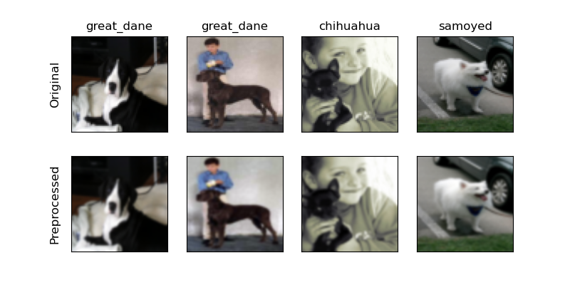
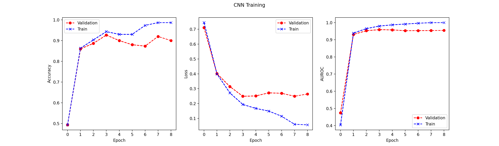
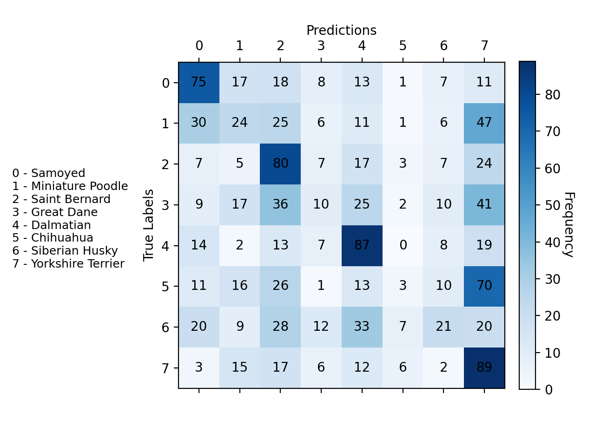
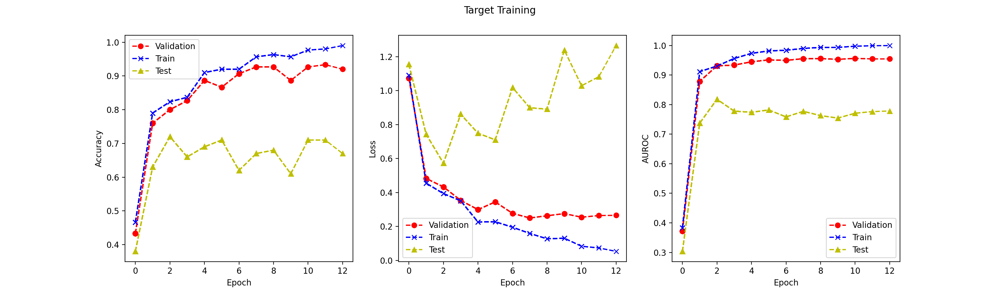
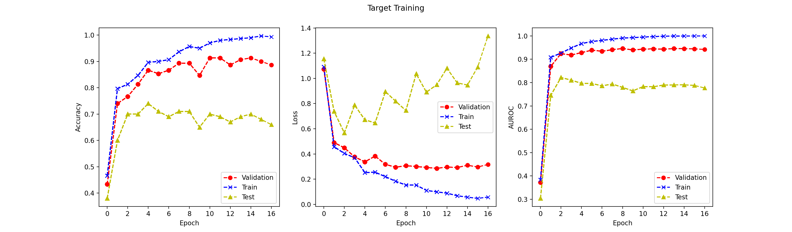
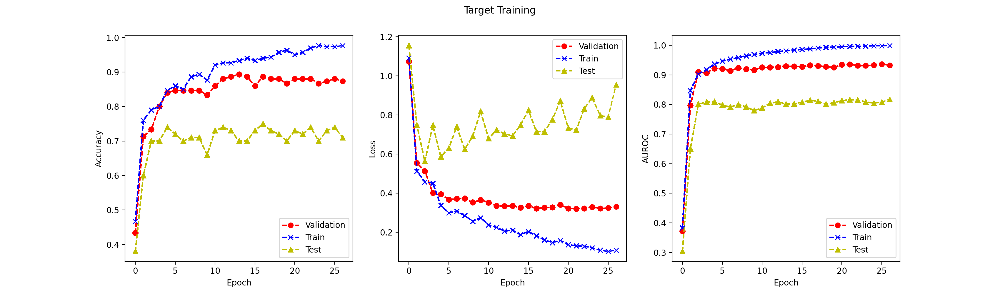
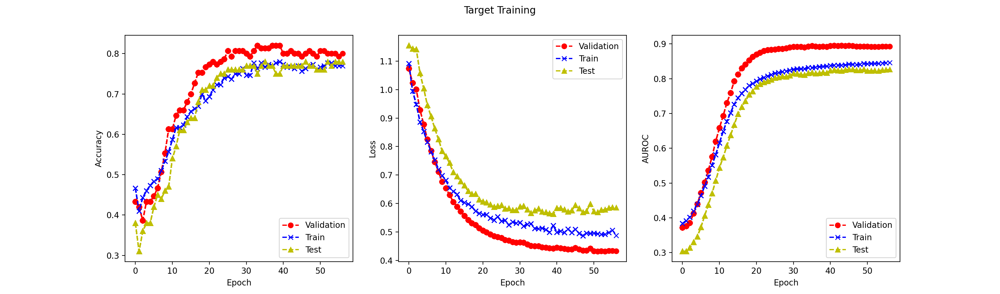
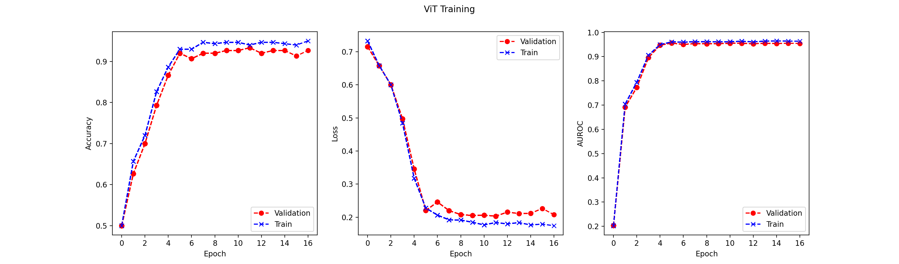
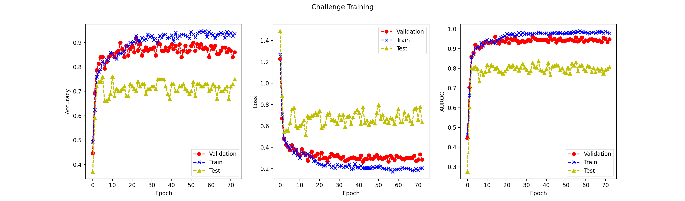

# Paco's Puppy Problem — Deep Learning for Dog Breed Classification

A deep learning project (EECS 445, University of Michigan) that classifies dog breeds from 64×64 images, built to **compare CNNs, transfer learning, and Vision Transformers** on the same task — and to diagnose *why* they succeed or fail.

> This repository is a write-up of the project — architecture, methodology, and results. The source code lives in a separate private repository for academic-integrity reasons.

---

## Overview

Paco's puppies escaped, and the task was to identify them from images. I built an end-to-end image classification pipeline in **PyTorch** and used it to answer a research question: *how much does performance improve as you move from a baseline CNN → transfer learning → a Vision Transformer built from scratch — and where does each approach break?*

**The problem:**
- **Dataset:** 8,867 dog images (only ~300 samples for the binary target task)
- **Image size:** 64×64 RGB
- **Primary task:** binary classification — Golden Retriever vs. Collie
- **Auxiliary task:** 8-class breed classification, used for pretraining/representation learning
- **Framework:** PyTorch

---

## Headline Results

| Model | Val AUROC | Test AUROC | Params |
|---|---|---|---|
| Baseline CNN | 0.962 | 0.751 | 39,754 |
| Transfer learning (freeze all conv layers) | 0.892 | **0.826** | — |
| Vision Transformer (from scratch) | 0.955 | 0.553 | 7,394 |
| **Challenge model (ensemble)** | — | **0.812** | — |

**The most important finding:** the baseline CNN's strong validation AUROC (0.962) collapsed to 0.751 on test — a classic case of the model **learning backgrounds instead of dogs**. Transfer learning with frozen features acted as a regularizer and pushed test AUROC up to **0.826**, the best result in the project.

---

## What I Built

### 1. Data preprocessing pipeline
Computes **per-channel mean and standard deviation on the training split only** (to avoid data leakage), standardizes all splits, and converts images into PyTorch tensors. Includes visualization tooling for raw data and label distributions.

### 2. Baseline CNN
A 3-layer convolutional network (39,754 parameters) trained with Adam, patience-based early stopping, and checkpointing.

- Compared **early-stopping patience of 5 vs. 10** — patience of 5 (stopped at epoch 13) generalized better than patience of 10 (epoch 18).
- Studied classifier capacity: widening the final conv layer 8 → 64 filters (FC input 32 → 256) improved AUROC but overfit sooner.
- **Diagnosed the failure mode:** the val→test drop (0.962 → 0.751) traces to a **background bias** — Collies tended to appear in grassy/outdoor settings while Golden Retrievers had varied backgrounds. The model learned to classify *backgrounds*, not breeds.

The label visualization that exposed the background bias:

### 3. Source pretraining + transfer learning
Trained the same backbone on the **8-class auxiliary breed problem** (best epoch 11, val loss 1.79), then transferred those weights and ran a controlled **freezing study**:

| Frozen conv layers | Val AUROC | Test AUROC |
|---|---|---|
| 0 (fully fine-tuned) | 0.955 | 0.777 |
| ... | ... | ... |
| All frozen | 0.892 | **0.826** |

**Key insight:** more frozen layers → *lower* validation AUROC but *higher* test AUROC. Frozen source features act as a regularizer, preventing the model from re-learning the background shortcut.

The source-task confusion matrix (easiest breeds: Samoyeds, Saint Bernards, Dalmatians, Yorkshire Terriers; hardest: Miniature Poodles, Great Danes, Siberian Huskies):

Transfer-learning training curves across freezing configurations:

### 4. Vision Transformer (from scratch)
Implemented a ViT (7,394 parameters) in PyTorch entirely from core components: **patchification**, **sinusoidal positional embeddings**, **multi-head self-attention** (per-head Q/K/V, scaled dot-product), **transformer encoder blocks** with residual connections and pre-norm, and a learnable **classification token** (BERT-style `[CLS]`) with an MLP head.

**Result & analysis:** ViT reached 0.955 val AUROC but only **0.553 test AUROC** — barely above random. With ~300 training samples, the ViT lacked the inductive biases (translation invariance, locality) that CNNs get for free, so it couldn't learn effective attention patterns. A concrete demonstration of *why CNNs still win on small image datasets*.

### 5. Challenge model — best overall (0.812 test AUROC)
Combined the lessons from every prior experiment:
- **Transfer learning** from Source epoch 11
- **Froze the first two conv layers**, fine-tuned conv3 + FC head — freezing all three underfit (~0.70), since conv3 needs task-specific features
- **Dropout 0.3** — tuned by hand (0.4 too aggressive for 300 samples, 0.2 overfit)
- **L2 weight decay 0.01** via Adam
- **Random horizontal flip** as the *only* augmentation — rotations/color jitter added more noise than signal
- **ReduceLROnPlateau** scheduler (halves LR after 5 stagnant epochs)
- **Early stopping**, patience 30, lowest val loss
- **Checkpoint ensembling** — averaged softmax probabilities across the top 5 epochs (36, 55, 41, 33, 53)

Individual epoch AUROCs ranged 0.807–0.819; the ensemble landed at **0.812**. A fixed random seed ensured full reproducibility.

---

## Methodology Highlights

| Decision | What I did | Why it mattered |
|---|---|---|
| Normalization | Train-split stats only | Prevented data leakage |
| Early stopping | Compared patience 5 vs. 10 | Avoided overfitting |
| Transfer learning | Freezing study (0–all layers) | Frozen features regularized against background bias |
| Bias diagnosis | Inspected label visualizations | Explained the val→test collapse |
| ViT | Built attention from scratch | Direct CNN-vs-transformer comparison |
| Regularization | Tuned dropout, weight decay, augmentation | Balanced capacity vs. generalization on 300 samples |
| Final predictions | 5-epoch checkpoint ensemble | Reduced variance on unseen data |

---

## Tech Stack

- **Language:** Python
- **Framework:** PyTorch
- **Techniques:** CNNs, transfer learning, Vision Transformers, multi-head self-attention, data augmentation, regularization, learning-rate scheduling, checkpoint ensembling

---

## Skills Demonstrated

- Implementing neural network architectures **from scratch**, including multi-head self-attention and positional embeddings
- Designing and interpreting **controlled experiments** (freezing studies, patience sweeps, capacity studies)
- **Diagnosing failure modes** — identifying background bias as the cause of a val→test performance collapse
- Transfer learning and representation learning
- Rigorous ML hygiene: train-only normalization, proper model selection, reproducibility via fixed seeds
- Evaluation and communication: confusion matrices, training curves, AUROC-based comparison
